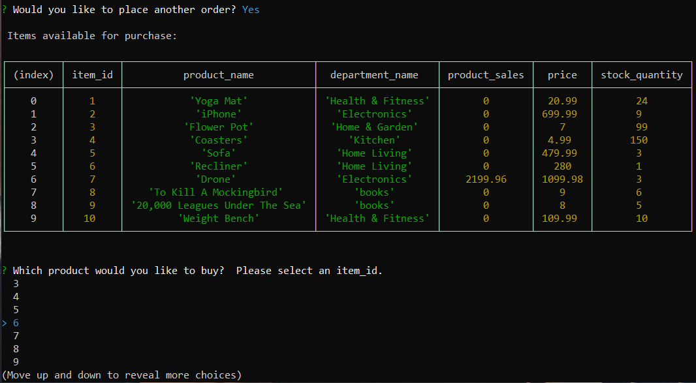
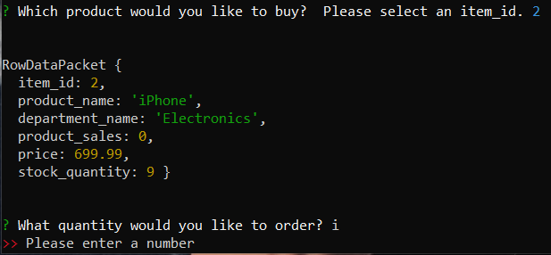

# Bamazon

Bamazon is an online store like app utilizing MySQL Workbench to create and update table data reflecting an online inventory, built with Node.js.  The package.json file within the repo already contains the following dependencies:

* dotenv
* MySQL
* Inquirer

Therefore, from the command line in the terminal of the root directory, simply type:

```npm install```

This will install the appropriate NPM packages.  After forking the repo, and installing the dependencies, users will have to create their own .env file locally.  The .env file should contain the following information:

```
host: "localhost",
port: 3306,
user: "root",
password: "Your Password",
database: "bamazon_db"
```

For more information, visit the NPM dotenv DOC's here [npm dotenv](https://www.npmjs.com/package/dotenv).

To run the application, table data needs to exist in MySQL Workbench.  Copy the schema from bamazon.sql, and paste it into Workbench.  Click the lightening bolt to execute, this will create the database.


From the terminal command line, type:

```node bamazonCustomer.js```

This will run the program, and display the table data.  The user will also be prompted to use the up and down arrow keys to make a selection by pressing enter.


After making a selection, the user will be asked what quantity they would like to purchase for the item previously selected.


If there is enough quantity in stock, the order is placed and the user is asked if they would like to place another order.


Everytime an order is successfully placed, the table stock quantity and product sales columns are updated.



If the user requests a quantity in excess of what is in stock, a message is displayed stating "Insufficient quantity".


As long as the user answers with a "y" when asked if they would like to place another order, subsequent orders can be placed.


When prompted with what quantity to buy, if a character other than an integer is entered, the user will be prompted to enter a number.



When the user answers the "Would you like to place another order?" prompt with an "n", the connection to the store is terminated.


Thanks for visiting.

